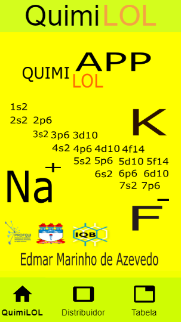
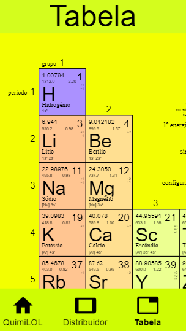
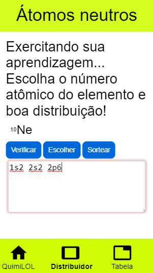

# QuimiLOL

Aplicativo produzido para a conclusão do mestrado do professor Edmar Marinho De Azevedo, que atual é
mestre em química.

O aplicativo ainda não se encontra disponível para download por razões burocráticas

# Características

    

        O aplicativo tem seu MVP (mínimo produto viável) finalizado. No entando, tem se pensando
        em lançar uma nova versão futuramente para incluir mais funcionalidades e mudanças no designer.
        Obs: O atual design do app foi solicidado pelo atual mestre em química (ele buscou deixar as 
        informações o mais visíveis possível para os dautônicos, visto que ele mesmo é).
    
 

    

        O aplicativo gira em torno do diagrama de linus, mais conhecido como distribuição eletrônica. 
        No aplicativo você pode escolher se quer realizar uma distribuição utilizando elementos neutros ou
        íonizados, além da tela principal conter o diagrama de linus projetado pelo próprio professor.
        Ah, e não menos importante, no aplicativo também se encontra uma tabela periódica.
    
 

# Objetivo 

 
    Algumas pessoas tem dificuldade de aprender certos assuntos e a matéria de química não está entre as 
    favoritas dos alunos. Por isso pensamos: Por que não criar um aplicativo onde o aluno poderá errar 
    quantas vezes quiser e não ser penalizado por isso? Ou um aplicativo que sirva de guia para ele poder 
    simular situações que possam cair na prova? Ou ainda um aplicativo que o ajudasse a diminuir sua ansiedade 
    antes de uma prova?

    Daí surguiu a ideia de criar um aplicativo que ajudasse os alunos a aprender e praticar 
    a distribuição eletrônica (diagrama de Linus) da forma corretas e quantas vezes fosse
    necessário, sem que ele seja penalizado por seus erros.
    Foi aí que surguiu o QuimiLOL que tem todas as suas distribuições aprovados por um mestre em química.

